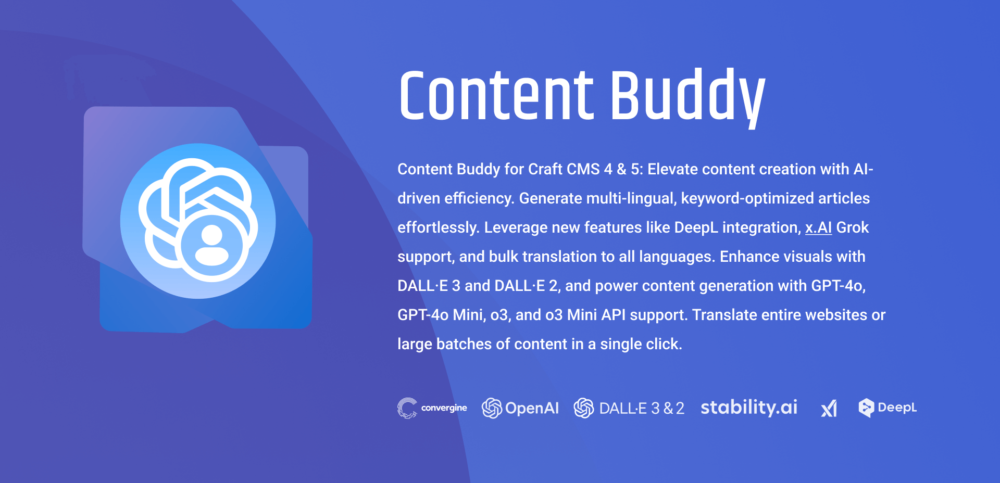
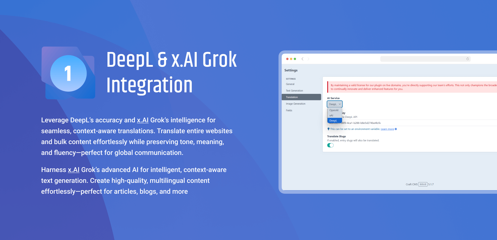
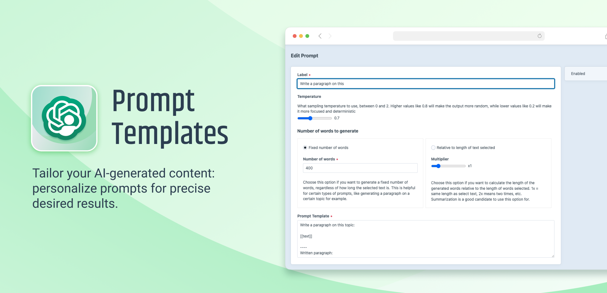
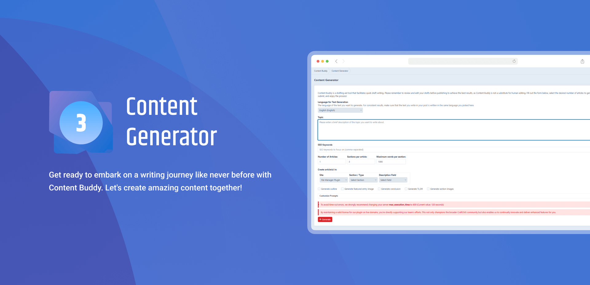
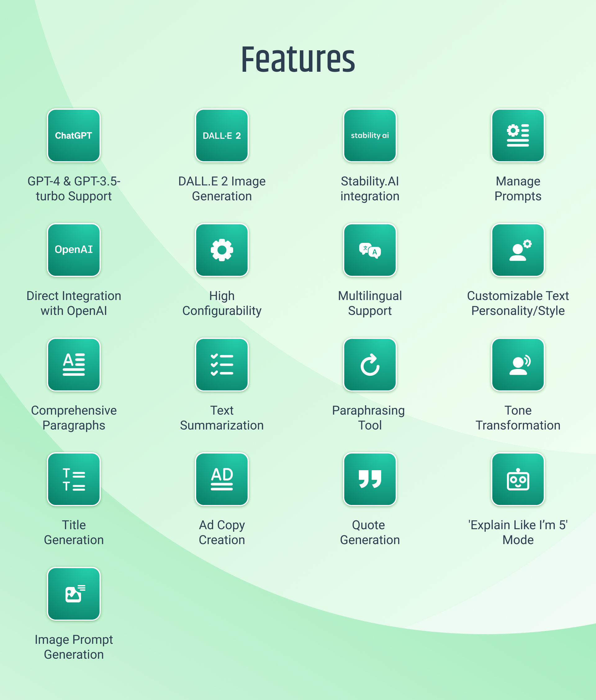

# Content Buddy for Craft CMS 4 / Craft CMS 5






Content Buddy, an AI-powered CraftCMS plugin, simplifies your content creation tasks. Leveraging OpenAI's ChatGPT, it generates multi-lingual, keyword-focused articles and entries swiftly and efficiently. 

Configurable settings allow you to control the length and style of generated content, while the image inclusion feature, powered by DALL.E 2, visually enhances your posts. 

Additionally, the plugin offers the convenience of customized prompts, accessible via a dropdown menu in text fields, textareas, and redactor fields, giving your content a unique touch. 

## Features

- **GPT-4 & GPT-3.5-turbo Support**: Content Buddy works with OpenAI's most advanced text generation models, including the latest GPT-4 and GPT-3.5-turbo, for exceptional human-like text generation.

- **DALL.E 2 Image Generation**: Create perfect matching images for your posts directly from your editor using DALL.E 2 API.

- **Manage Prompts**: Conveniently add, edit, and reorder prompts in all supported languages, accessible directly from the editor’s “AI” menu.

- **Direct Integration with OpenAI**: Avoid monthly subscriptions or middleman fees with direct integration to OpenAI's API.

- **High Configurability**: Choose from multiple AI models, control text quantity, and manage settings for precise cost and output control.

- **Multilingual Support**: Opt from an array of languages, with new ones added based on customer requests.

- **Customizable Text Personality/Style**: Adjust the style or persona of the generated text (exclusive to GPT-4 and GPT-3.5-turbo).

- **Comprehensive Paragraphs**: Generate full paragraphs on any topic.

- **Text Summarization**: Effortlessly generate summaries for improved comprehension.

- **Paraphrasing Tool**: Edit text quickly and efficiently.

- **Tone Transformation**: Recast text in a sarcastic tone for engaging content.

- **Title Generation**: Create fitting, catchy titles.

- **Ad Copy Creation**: Transform plain text into intriguing ad copy.

- **Quote Generation**: Produce relevant quotes to support your message.

- **'Explain Like I’m 5' Mode**: Simplify complex concepts with a click.

- **Image Prompt Generation**: Use AI creativity to generate image prompts for text-to-image models, enhancing article visuals.

## Requirements

- OpenAI Account with API key
- Craft CMS 4.0.0 or later
- PHP 8.0.2 or later

## Installation

You can install this plugin from the Plugin Store or with Composer.

#### From the Plugin Store

Go to the Plugin Store in your project’s Control Panel and search for “Content Buddy”. Then click on the “Install” button in its modal window.

#### With Composer

Open your terminal and run the following commands:

```bash
# go to the project directory
cd /path/to/my-project.test

# tell Composer to load the plugin
composer require convergine/craft-content-buddy

# tell Craft to install the plugin
./craft plugin/install convergine-contentbuddy
```

## Roadmap
- **Scheduled Content Generation**: allow Content Buddy to generate content on a schedule, with various controls, list of different topics etc.
- **More Image AI Integrations**: integration with other generative AI projects, aside from DALL.E 2.
- **RSS Feeds Integration**: allow Content Buddy to generate content from RSS feeds and based on schedule.
- **Model Fine-Tuning**: allow users to fine-tune models for their specific needs.
- more settings and controls for plugin, including import/export settings functionality.

## Support

For any issues or questions, you can reach us by email info@convergine.com or by opening an issue on GitHub.
